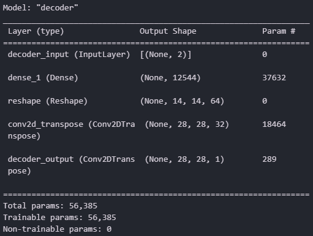
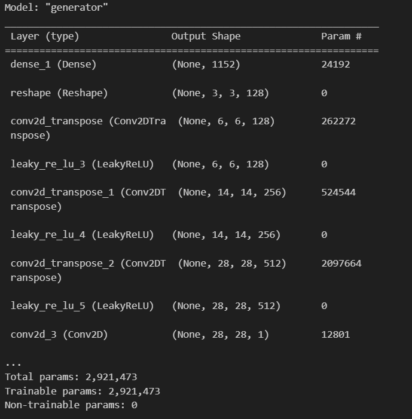

# Compressed Sensing using Generative Models

[](https://github.com/RenatoGallicola/Compressed-Sensing-using-Generative-Models/actions/workflows/ci.yml)
[](https://www.python.org/)
[](https://www.tensorflow.org/)
[](LICENSE)
[](https://arxiv.org/abs/1703.03208)

Reproduction and extension of **Bora, Jalal, Price & Dimakis, *Compressed Sensing
using Generative Models* (ICML 2017)** on MNIST: a DCGAN generator and a VAE
decoder are used as *learned priors* to reconstruct images from a handful of
random linear measurements, and benchmarked against the classical Lasso/DCT
sparsity prior.

> Course project for **Numerical Analysis for Machine Learning**, MSc in Computer
> Science and Engineering, Politecnico di Milano.
> The original write-up is in [`docs/NAML_project_report.pdf`](docs/NAML_project_report.pdf).

<!-- RESULTS-HERO -->

---

## The problem

Compressed sensing reconstructs an unknown signal $x^{\ast} \in \mathbb{R}^n$ from far
fewer measurements than its dimension:

$$y = A x^{\ast} + \eta, \qquad A \in \mathbb{R}^{m \times n}, \quad \eta \sim \mathcal{N}(0, \sigma^2 I), \quad m \ll n.$$

With $m \ll n$ the system is underdetermined and has infinitely many solutions,
so recovery is only possible by assuming *structure*. Classical theory assumes
**sparsity in a fixed basis**, $x^{\ast} = \Psi\theta$ with few non-zero
$\theta_i$, and recovers $x^{\ast}$ with an $\ell_1$ program such as Lasso.

This project replaces that assumption with a much stronger, *learned* one: that
$x^{\ast}$ lies near the range of a trained generator $G : \mathbb{R}^k \to \mathbb{R}^n$.
Instead of "few active coefficients", the prior says "**looks like a digit**".

## The method

Recovery becomes a search in the latent space of the generator rather than in
signal space:

$$\hat z = \arg\min_{z \in \mathbb{R}^k} \; \lVert A\,G(z) - y \rVert_2^2 + \lambda \lVert z \rVert_2^2, \qquad \hat x = G(\hat z).$$

Since $G$ is a deep network the objective is non-convex, so it is minimised with
**Adam on $z$** (the generator weights stay frozen) from **several random
restarts**, keeping the restart with the smallest measurement residual. The
theoretical pay-off, and the reason the approach works with so few
measurements, is that the sample complexity scales with the *latent* dimension:
if $G$ is $L$-Lipschitz, $O(k \log L)$ Gaussian measurements suffice for an
$\ell_2/\ell_2$ recovery guarantee.

Two priors are trained on MNIST, each at $k = 20$ and $k = 30$:

| | prior | trained by | used at recovery time |
|---|---|---|---|
| **VAE** | convolutional encoder/decoder, diagonal Gaussian posterior | maximising the ELBO | the **decoder** is $G$ |
| **DCGAN** | strided conv generator + discriminator | adversarial minimax game | the **generator** is $G$ |

<p align="center">
  
  
</p>

The measurement matrix $A$ has i.i.d. $\mathcal{N}(0, 1/m)$ entries, which makes
it an approximate isometry in expectation ($\mathbb{E}\lVert Ax \rVert^2 = \lVert x \rVert^2$),
so errors in measurement space and signal space stay on the same scale as $m$
changes.

<!-- RESULTS-SECTION -->

## Repository layout

```
├── src/csgm/                  installable package -- all the logic lives here
│   ├── measurements.py          random Gaussian sensing operator
│   ├── recovery.py              latent-space optimisation (the core algorithm)
│   ├── baselines.py             Lasso in an orthonormal DCT basis
│   ├── metrics.py               per-pixel L2 error, PSNR
│   ├── data.py, viz.py          MNIST loading, plotting helpers
│   └── models/                  VAE, DCGAN, checkpoint loading
├── scripts/                   command-line entry points
│   ├── train_vae.py             train the VAE, save the decoder
│   ├── train_dcgan.py           train the DCGAN, save the generator
│   ├── run_benchmark.py         the full sweep -> results/benchmark.csv
│   └── make_figures.py          csv -> figures and summary tables
├── notebooks/                 narrated walkthrough (01 VAE, 02 DCGAN, 03 Lasso, 04 recovery)
├── models/                    pre-trained checkpoints (k = 20 and k = 30)
├── results/figures/           generated figures
├── docs/                      project report and architecture diagrams
└── tests/                     pytest suite covering the package
```

## Getting started

```bash
git clone https://github.com/RenatoGallicola/Compressed-Sensing-using-Generative-Models.git
cd Compressed-Sensing-using-Generative-Models

python -m venv .venv && source .venv/bin/activate      # Windows: .venv\Scripts\activate
pip install -e ".[dev]"
pytest -q
```

> **NumPy is pinned below 2.0.** The TensorFlow 2.16/2.17 wheels are built
> against the NumPy 1.x ABI and fail to import otherwise.

Reconstruct a digit from 100 measurements, 13% of its 784 pixels:

```python
from csgm import gaussian_measurement_matrix, load_mnist, measure, per_pixel_l2, recover
from csgm.models import load_generator

(_, _), (x_test, _) = load_mnist(flatten=True)
x_star = x_test[0]

G = load_generator("dcgan", latent_dim=20)
A = gaussian_measurement_matrix(m=100, n=784, seed=0)
y = measure(x_star, A, noise_std=0.01, seed=0)

result = recover(G, y, A, latent_dim=20)
print(f"per-pixel error: {per_pixel_l2(result.x_hat, x_star)[0]:.4f}")
```

## Reproducing the results

```bash
# 1. (optional) retrain the priors -- pre-trained checkpoints ship in models/
python scripts/train_vae.py   --latent-dim 20 --epochs 100
python scripts/train_dcgan.py --latent-dim 20 --epochs 50

# 2. sweep every prior over every measurement budget  (~3 h on CPU)
python scripts/run_benchmark.py --n-images 10 --steps 1000 --restarts 10

# 3. turn the raw table into figures and summary tables
python scripts/make_figures.py
```

`run_benchmark.py` writes `results/benchmark.csv`, one row per
(method, $m$, image), so the analysis can be redone without re-running the sweep.
Every random draw (measurement matrices, noise, latent initialisations and the
choice of test images) is derived from a single `--seed`.

The notebooks are stored **without outputs** so diffs stay readable; run them to
regenerate the plots, or read the figures in [`results/figures/`](results/figures).

## Notes on the method, and what changed from the original report

The experiment was re-implemented from the notebooks that produced
[the report](docs/NAML_project_report.pdf). Four things were corrected or made
explicit along the way; the qualitative conclusions are unchanged, the numbers
are not directly comparable.

1. **Error is now measured against the ground truth.** The original curves
   plotted the *measurement residual* $\lVert A G(\hat z) - y \rVert$, which is
   what the optimiser minimises. It shrinks as $m$ decreases simply because
   there are fewer constraints to satisfy, so it cannot be compared across
   budgets or against Lasso (whose curve did use the reconstruction error).
   Everything here reports $\lVert \hat x - x^{\ast} \rVert^2 / n$, the metric used
   by Bora et al.
2. **The measurement matrix is scaled by $1/\sqrt{m}$, not $1/m$.** Only the
   former gives $\mathbb{E}\lVert Ax \rVert^2 = \lVert x \rVert^2$; with $1/m$
   the measurements shrink as the budget grows, which distorts both the noise
   level and any comparison across $m$.
3. **Latent codes are initialised from $\mathcal{N}(0, I)$**, the prior the
   generators were actually trained under, instead of $\mathcal{N}(0, 10^{-4}I)$.
   Starting near the origin biases the search towards the blurry centre of the
   latent space.
4. **Averaging over images and matching the inputs across methods.** Curves are
   averaged over 10 stratified test digits (one per class) rather than a single
   image, and every method sees the same $A$, the same noise and the same
   targets at each budget.

The checkpoints were also re-saved in the Keras 3 format: the originals were
legacy HDF5 files with a `.keras` extension and no longer load on current
TensorFlow. Weights are bit-identical.

### Limitations

- **Representation error sets the floor.** Recovery can only return an image the
  generator can produce, so beyond a few hundred measurements the error stops
  improving no matter how much optimisation is thrown at it. A sparsity prior
  has no such ceiling.
- **MNIST is easy.** Digits are a low-dimensional, near-binary manifold; the
  gap over Lasso would narrow on richer datasets.
- **Recovery is expensive.** Each reconstruction runs 1000 gradient steps
  by 10 restarts through the generator, orders of magnitude slower than a
  single convex solve.

## References

1. A. Bora, A. Jalal, E. Price, A. G. Dimakis. *Compressed Sensing using
   Generative Models*. ICML 2017. [arXiv:1703.03208](https://arxiv.org/abs/1703.03208)
2. D. P. Kingma, M. Welling. *Auto-Encoding Variational Bayes*. ICLR 2014.
   [arXiv:1312.6114](https://arxiv.org/abs/1312.6114)
3. A. Radford, L. Metz, S. Chintala. *Unsupervised Representation Learning with
   Deep Convolutional Generative Adversarial Networks*. ICLR 2016.
   [arXiv:1511.06434](https://arxiv.org/abs/1511.06434)
4. I. Goodfellow et al. *Generative Adversarial Networks*. NeurIPS 2014.
   [arXiv:1406.2661](https://arxiv.org/abs/1406.2661)
5. E. J. Candès, J. Romberg, T. Tao. *Robust Uncertainty Principles: Exact Signal
   Reconstruction from Highly Incomplete Frequency Information*. IEEE Trans.
   Inf. Theory, 2006.

## Authors

**Renato Gallicola** and **Matteo Forlivesi**, Politecnico di Milano.

Released under the [MIT License](LICENSE). MNIST is distributed under the
[CC BY-SA 3.0](https://creativecommons.org/licenses/by-sa/3.0/) license.
