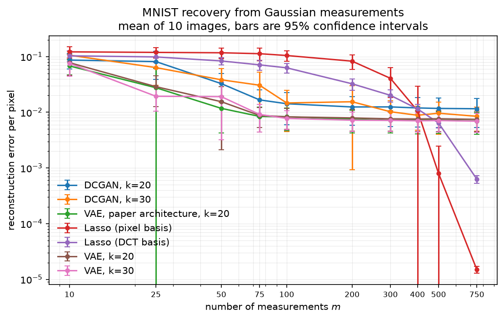
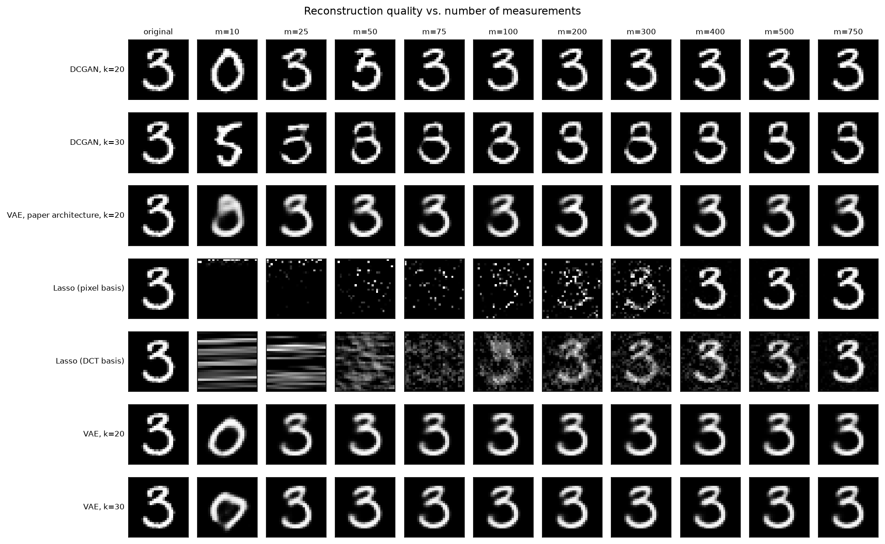
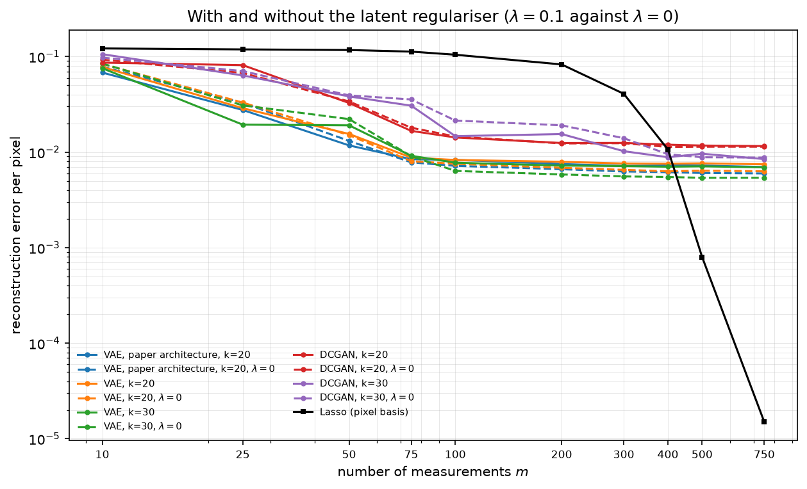

# Compressed Sensing using Generative Models

[](https://github.com/RenatoGallicola/Compressed-Sensing-using-Generative-Models/actions/workflows/ci.yml)
[](https://www.python.org/)
[](https://www.tensorflow.org/)
[](LICENSE)
[](https://arxiv.org/abs/1703.03208)

Reproduction and extension of **Bora, Jalal, Price & Dimakis, *Compressed Sensing
using Generative Models* (ICML 2017)** on MNIST: a DCGAN generator and a VAE
decoder are used as *learned priors* to reconstruct images from a handful of
random linear measurements, and benchmarked against Lasso in two sparsifying
bases as the classical sparsity prior.

> Course project for **Numerical Analysis for Machine Learning**, MSc in Computer
> Science and Engineering, Politecnico di Milano.
> The original write-up is in [`docs/NAML_project_report.pdf`](docs/NAML_project_report.pdf).

<p align="center">
  
</p>

**A VAE prior recovers an MNIST digit from 50 random measurements about as
accurately as Lasso in a DCT basis does from 400, an 8x saving, and it is the
more accurate of the two on 8 of the 10 test digits at that budget.** From 500
measurements the ranking reverses and Lasso wins outright, because a generative
prior can only ever return an image its generator is able to produce. Both
effects, and the threshold, are what Bora et al. report.

---

## The problem

Compressed sensing reconstructs an unknown signal $x^{\ast} \in \mathbb{R}^n$ from far
fewer measurements than its dimension:

$$y = A x^{\ast} + \eta, \qquad A \in \mathbb{R}^{m \times n}, \quad \eta \sim \mathcal{N}(0, \sigma^2 I), \quad m \ll n.$$

With $m \ll n$ the system is underdetermined and has infinitely many solutions,
so recovery is only possible by assuming *structure*. Classical theory assumes
**sparsity in a fixed basis**, $x^{\ast} = \Psi\theta$ with few non-zero
$\theta_i$, and recovers $x^{\ast}$ with an $\ell_1$ program such as Lasso.

This project replaces that assumption with a much stronger, *learned* one: that
$x^{\ast}$ lies near the range of a trained generator $G : \mathbb{R}^k \to \mathbb{R}^n$.
Instead of "few active coefficients", the prior says "**looks like a digit**".

## The method

Recovery becomes a search in the latent space of the generator rather than in
signal space:

$$\hat z = \arg\min_{z \in \mathbb{R}^k} \; \lVert A\,G(z) - y \rVert_2^2 + \lambda \lVert z \rVert_2^2, \qquad \hat x = G(\hat z).$$

Since $G$ is a deep network the objective is non-convex, so it is minimised with
**Adam on $z$** (the generator weights stay frozen) from **several random
restarts**, keeping the restart with the smallest measurement error. The penalty term is
excluded from that ranking: it would reward a small $\lVert z \rVert$ rather
than a faithful reconstruction. The
theoretical pay-off, and the reason the approach works with so few
measurements, is that the sample complexity scales with the *latent* dimension:
if $G$ is $L$-Lipschitz, $O(k \log L)$ Gaussian measurements suffice for an
$\ell_2/\ell_2$ recovery guarantee.

Three priors are compared on MNIST. Two are our own, trained at both
$k = 20$ and $k = 30$; the third is the network of the reference paper, kept so
that our numbers can be compared with theirs directly:

| | prior | trained by | used at recovery time |
|---|---|---|---|
| **VAE** | convolutional encoder/decoder, diagonal Gaussian posterior | maximising the ELBO | the **decoder** is $G$ |
| **DCGAN** | strided conv generator + discriminator | adversarial minimax game | the **generator** is $G$ |
| **VAE, paper architecture** | fully connected $784$-$500$-$500$-$20$ | maximising the ELBO | the **decoder** is $G$ |

Both generators map $z \in \mathbb{R}^k$ to a $28 \times 28$ image through a
projection followed by transposed convolutions, but at very different scales:

| stage | VAE decoder | DCGAN generator |
|---|---|---|
| project | dense to $14 \times 14 \times 64$ | dense to $3 \times 3 \times 128$ |
| upsample | transposed conv, 32 filters, to $28 \times 28$ | transposed convs with 128, 256 and 512 filters, to $6^2$, $14^2$, $28^2$ |
| output | transposed conv, 1 filter, sigmoid | conv, 1 filter, sigmoid |
| parameters ($k=20$) | 282,177 | 2,921,473 |

The paper's decoder has 653,784 parameters, between the two. Size is only part
of the story for the cost of inverting them, as the Cost section below shows,
and it buys nothing at all in accuracy.

The measurement matrix $A$ has i.i.d. $\mathcal{N}(0, 1/m)$ entries, which makes
it an approximate isometry in expectation ($\mathbb{E}\lVert Ax \rVert^2 = \lVert x \rVert^2$),
so errors in measurement space and signal space stay on the same scale as $m$
changes.

## Results

Ten test digits, one per class, recovered by every method from the same
measurement matrices and the same noise, with the latent regulariser at the
value the reference paper recommends. Error is the squared distance to the
ground truth, per pixel; lower is better.

|   m | Lasso (pixel) | Lasso (DCT) | VAE (paper arch.) | VAE k=20 | VAE k=30 | DCGAN k=20 | DCGAN k=30 |
|----:|--------------:|------------:|------------------:|---------:|---------:|-----------:|-----------:|
|  10 |        0.1309 |      0.1539 |        **0.0609** |   0.0635 |   0.0766 |     0.1021 |     0.0833 |
|  25 |        0.1255 |      0.1049 |            0.0291 |   0.0372 |**0.0225**|     0.0619 |     0.0465 |
|  50 |        0.1172 |      0.0850 |        **0.0110** |   0.0131 |   0.0177 |     0.0430 |     0.0347 |
|  75 |        0.1125 |      0.0707 |        **0.0079** |   0.0111 |   0.0094 |     0.0248 |     0.0319 |
| 100 |        0.1048 |      0.0560 |        **0.0076** |   0.0106 |   0.0080 |     0.0137 |     0.0291 |
| 200 |        0.0829 |      0.0366 |        **0.0067** |   0.0097 |   0.0077 |     0.0106 |     0.0235 |
| 300 |        0.0406 |      0.0206 |        **0.0066** |   0.0096 |   0.0074 |     0.0105 |     0.0247 |
| 400 |        0.0108 |      0.0117 |        **0.0066** |   0.0096 |   0.0074 |     0.0098 |     0.0223 |
| 500 |    **0.0002** |      0.0065 |            0.0066 |   0.0096 |   0.0074 |     0.0094 |     0.0238 |
| 750 |    **0.0000** |      0.0015 |            0.0064 |   0.0094 |   0.0072 |     0.0095 |     0.0225 |

Full table in [`results/benchmark.csv`](results/benchmark.csv), one row per
method, budget and image. The same sweep without the regulariser is in
[`results/unregularised/`](results/unregularised).

**Two baselines, not one.** Bora et al. run Lasso on MNIST in the *pixel* basis,
since digits are mostly background and therefore already sparse there. The DCT
basis is what the same authors use for natural images. The two behave very
differently here: the DCT basis is the better of the two from 25 to 300
measurements, the pixel basis at 10 and from 400 up, where it becomes almost
exact. Reporting only one would misrepresent how strong the classical method is.
The
shrinkage was swept over six values spanning five orders of magnitude for each
basis and set to its best value, and reconstructions are clipped to `[0, 1]`, which also helps the
baseline.

### Three regimes

**Scarce measurements, up to about 200.** Every learned prior beats both
baselines. At 25 measurements the best of them is 5.6x more accurate than the
paper's baseline and 4.7x more accurate than the DCT one, at a budget where
neither returns anything recognisable as a digit.

**Sample efficiency**, measured against the DCT baseline, which reaches 0.0117
at 400 measurements. The paper's architecture reaches that level with **50**, an
**8x** saving, beating the baseline on 8 of the 10 individual digits there. Our
convolutional VAE at k=30 needs 75, a 5.3x saving on 7 of 10 digits; at k=20 it
also needs 75 but wins on only 5 of 10, so its saving is nominal. The DCGAN needs
200, a 2x saving on 8 of 10. Bora et al. report 5 to 10x, so the reproduction of
their architecture lands inside that interval.

The pixel baseline cannot be the reference at this budget, and that is worth
saying rather than hiding. At 400 measurements its mean error is 0.0108 but its
median is 0.0005: six of the ten digits are already recovered to better than
0.001 and one is still at 0.084. That budget sits in the middle of its transition
from failure to near-exact recovery, so its mean describes the digits it has not
solved rather than a level anything can be compared against. The DCT baseline
there has mean 0.0117, median 0.0124 and worst case 0.0169.

**Abundant measurements, from 500 up.** Lasso in the pixel basis overtakes every
learned prior and keeps improving, reaching an error below 1e-4 at 750
measurements against 0.0064 for the best generative model. Once the budget
approaches the 784 dimensions of the signal, sparsity in pixel space recovers a
digit almost exactly while the generative prior stays put. Nothing is wrong with
the optimisation: the generative curves are flat because the reconstruction is
confined to the range of the generator, and the distance from a real digit to
that range does not depend on how many measurements are taken. Averaged over the
budgets from 300 up, that floor is 0.0065 for the paper architecture, 0.0074 and
0.0095 for our convolutional VAEs, 0.0098 and 0.0233 for the DCGANs.

<p align="center">
  
</p>

### What the comparisons survive

Every method sees the same images and the same matrices, so the comparisons are
paired and tested as such.

**The paper's simpler architecture beats ours.** At the same latent dimension,
its fully connected `784-500-500-20` network is more accurate than our
convolutional VAE at every budget, significantly so from 75 measurements upwards
(p at or below 0.004, better on 9 of 10 images). We did not expect that: the
convolutional model is the more sophisticated of the two.

**A larger latent space helps, but not when measurements are very scarce.** For
the convolutional VAE, `k=30` beats `k=20` from 75 measurements up (p = 0.028 at
75, at or below 0.005 above it). Below that the difference is not significant and
its sign is not stable.

**The VAE beats the DCGAN, but not at every budget.** It is significantly more
accurate at 10 and 50 measurements (p = 0.011 and 0.024) and not significantly so
at 25, 75 and 100; from 200 the two are indistinguishable, both on their floors.

### The latent regulariser

<p align="center">
  
</p>

The term helps where the measurements underdetermine the latent code and hurts
where they do not. At 10 measurements it improves the best model from 0.0808 to
0.0609, a 25% gain; at 750 it costs, moving 0.0054 to 0.0064. The sweep makes the
mechanism explicit: the norm of the recovered code falls monotonically with
lambda, from 7.7 to 2.5, and the value that minimises the error is **not fixed**.
It is 1 for all three priors at 10 and 25 measurements and 0 for all of them from
200 up; in between they disagree. The single value the paper recommends is a
compromise across regimes rather than an optimum at any one of them. The sweep
covers the three VAE priors only, since repeating it for the DCGANs would cost
hours.

### Cost

Recovering ten images at one budget, ten restarts and a thousand Adam steps:
1.4 s with Lasso in the pixel basis and 0.9 s in the DCT basis, 6.8 s with the
paper's decoder, about 15 s with our
convolutional decoders and about 496 s with a DCGAN generator, a **73x** gap
between the cheapest and the dearest learned prior. Parameter counts do not
explain that: the DCGAN generator is only 4.5x larger than the paper's decoder,
and our convolutional decoder is *smaller* than it yet twice as slow. What the
cost tracks is arithmetic per forward pass, and the DCGAN applies transposed
convolutions with 256 and 512 channels at nearly full resolution. The most
expensive prior is also the least accurate at almost every budget, so on this
dataset there is no trade-off to arbitrate.

### Training variance is part of the result

Training the same VAE with different seeds produced generators whose quality
varied by a **factor of 3.5**, comparable to the entire spread between the priors
being compared. The cause was partial posterior collapse, and a KL warm-up
removed it: the spread across seeds fell to a factor 1.2 and every model
improved. The selection procedure, fixed before the runs and unchanged
afterwards, is in [`docs/model_selection.md`](docs/model_selection.md).

## Repository layout

```
├── src/csgm/                  installable package -- all the logic lives here
│   ├── measurements.py          random Gaussian sensing operator
│   ├── recovery.py              latent-space optimisation (the core algorithm)
│   ├── baselines.py             Lasso in the pixel or the DCT basis
│   ├── metrics.py               per-pixel L2 error, PSNR
│   ├── data.py, viz.py          MNIST loading, plotting helpers
│   └── models/                  VAE, DCGAN, checkpoint loading
├── scripts/                   command-line entry points
│   ├── train_vae.py             train the VAE, save the decoder
│   ├── train_dcgan.py           train the DCGAN, save the generator
│   ├── run_benchmark.py         the full sweep -> results/benchmark.csv
│   ├── run_lambda_sweep.py      sensitivity to the latent regulariser
│   ├── tune_lasso.py            picks the baseline's basis and shrinkage
│   └── make_figures.py          csv -> figures and summary tables
├── notebooks/                 narrated walkthrough (01 VAE, 02 DCGAN, 03 Lasso, 04 recovery)
├── models/                    pre-trained checkpoints (k = 20 and k = 30)
├── results/                   benchmark table, summary tables and figures
├── docs/
│   ├── report/                  LaTeX source of the report
│   ├── figures/                 figures used in the docs
│   ├── model_selection.md       how the VAE checkpoints were chosen
│   ├── presentation_outline.md  slide-by-slide outline of the talk
│   └── NAML_project_report.pdf  the compiled report
└── tests/                     pytest suite covering the package
```

## Getting started

```bash
git clone https://github.com/RenatoGallicola/Compressed-Sensing-using-Generative-Models.git
cd Compressed-Sensing-using-Generative-Models

python -m venv .venv && source .venv/bin/activate      # Windows: .venv\Scripts\activate
pip install -e ".[dev]"
pytest -q
```

> **NumPy is pinned below 2.0.** The TensorFlow 2.16/2.17 wheels are built
> against the NumPy 1.x ABI and fail to import otherwise.

Reconstruct a digit from 100 measurements, 13% of its 784 pixels:

```python
from csgm import gaussian_measurement_matrix, load_mnist, measure, per_pixel_l2, recover
from csgm.models import load_generator

(_, _), (x_test, _) = load_mnist(flatten=True)
x_star = x_test[0]

G = load_generator("dcgan", latent_dim=20)
A = gaussian_measurement_matrix(m=100, n=784, seed=0)
y = measure(x_star, A, noise_std=0.01, seed=0)

result = recover(G, y, A, latent_dim=20)
print(f"per-pixel error: {per_pixel_l2(result.x_hat, x_star)[0]:.4f}")
```

## Reproducing the results

```bash
# 1. (optional) retrain the priors -- pre-trained checkpoints ship in models/
python scripts/train_vae.py   --latent-dim 20 --seed 1          # convolutional
python scripts/train_vae.py   --latent-dim 20 --architecture fc # paper's network
python scripts/train_dcgan.py --latent-dim 20 --epochs 50

# 2. sweep every prior over every measurement budget  (~3 h on CPU)
python scripts/tune_lasso.py          # pick the baseline's shrinkage first
python scripts/run_benchmark.py --n-images 10 --steps 1000 --restarts 10 --l2-penalty 0.1

# 3. how much the latent regulariser matters (VAE decoders only, ~30 min)
python scripts/run_lambda_sweep.py

# 4. turn the raw tables into figures and summary tables
python scripts/make_figures.py
```

`run_benchmark.py` writes `results/benchmark.csv`, one row per
(method, $m$, image), so the analysis can be redone without re-running the sweep.
Every random draw (measurement matrices, noise, latent initialisations and the
choice of test images) is derived from a single `--seed`.

It also writes `benchmark_meta.json` recording the protocol. Passing `--merge`
re-runs a subset of the methods and folds them into an existing table, which
refuses to proceed unless the recorded protocol matches, so results from two
runs cannot be pooled unless they are comparable.

The notebooks are committed **with their outputs**, so every plot is readable
straight from GitHub without installing anything. They were executed top to
bottom against the checkpoints and the benchmark table in this repository.

## Method notes

A few implementation choices determine what the numbers mean, so they are worth
stating explicitly.

**The measurement matrix is scaled by $1/\sqrt{m}$.** Entries are drawn i.i.d.
from $\mathcal{N}(0, 1/m)$, which makes $A$ an approximate isometry in
expectation. Measurement space and signal space then stay on the same scale as
the budget changes, and so does the effective noise level.

**Quality is measured against the ground truth.** Every curve reports
$\lVert \hat x - x^{\ast} \rVert^2 / n$, the metric used by Bora et al. The
measurement residual $\lVert A G(\hat z) - y \rVert$ is the quantity the
optimiser minimises, and it falls as $m$ shrinks simply because fewer
constraints remain to satisfy, so it is recorded as an optimisation diagnostic
and never as a score.

**Latent codes are initialised from $\mathcal{N}(0, I)$**, the prior the
generators were trained under. Starting much closer to the origin biases the
search towards the blurry centre of the latent space.

**The latent regulariser uses $\lambda = 0.1$**, the value Bora et al. report as
best on MNIST. `results/unregularised/` holds the same sweep with $\lambda = 0$,
so both variants can be compared as they are in the reference paper.

**Restarts are ranked on the measurement error alone**, never on the penalised
objective. Ranking on the objective would reward a small $\lVert z \rVert$
rather than a faithful reconstruction, and the measurement error is the only
criterion available when the ground truth is unknown.

**The VAEs are trained with a KL warm-up.** The weight of the KL term is ramped
from zero to one over the first ten epochs. Without it, training frequently ends
in partial posterior collapse and the quality of the resulting prior varies by a
factor of 3.5 between random seeds; see
[`docs/model_selection.md`](docs/model_selection.md).

**The baseline is given its best configuration.** Lasso is reported in two
bases, the pixel basis the reference paper uses for MNIST and the DCT basis it
uses for natural images, with the shrinkage swept per basis and set to its
minimum-error value, and with the reconstruction clipped to `[0, 1]`. A
comparison against a badly tuned baseline would say nothing.

**Two deliberate departures from the reference paper.** It binarises MNIST,
while every model here is trained and evaluated on the grayscale values scaled
to `[0, 1]`, so absolute error values are not directly comparable with the ones
it prints. And its experimental section specifies measurement entries with
standard deviation `1/m` where its own theorems use `N(0, 1/m)`; we follow the
theorems, since only that scaling makes `A` an approximate isometry.

**Every method sees the same inputs.** At each budget the same measurement
matrix, the same noise draw and the same ten stratified test digits, one per
class, are handed to Lasso and to each generative prior, and the curves are
averages over those ten images. Following Bora et al., the noise vector has a
fixed expected norm of 0.1 at every budget, so the per-component standard
deviation is $0.1/\sqrt{m}$.

### Limitations

- **Representation error sets the floor.** Recovery can only return an image the
  generator can produce, so beyond a few hundred measurements the error stops
  improving no matter how much optimisation is thrown at it. A sparsity prior
  has no such ceiling.
- **MNIST is easy.** Digits are a low-dimensional, near-binary manifold; the
  gap over Lasso would narrow on richer datasets.
- **Recovery is expensive.** Each reconstruction runs 1000 gradient steps
  by 10 restarts through the generator, orders of magnitude slower than a
  single convex solve.
- **Ten test images.** Enough for the comparisons between generative priors to
  reach significance from 75 measurements up, and for the VAE against the DCGAN
  at 10 and 50, but not everywhere in between. Which comparisons hold at which
  budget is stated above rather than averaged over.
- **The DCGANs were not retrained.** The variance study and the KL warm-up cover
  the VAEs only; retraining a DCGAN takes about ten hours on CPU, so its
  checkpoints are the original ones and the same variability may affect them.

## References

1. A. Bora, A. Jalal, E. Price, A. G. Dimakis. *Compressed Sensing using
   Generative Models*. ICML 2017. [arXiv:1703.03208](https://arxiv.org/abs/1703.03208)
2. D. P. Kingma, M. Welling. *Auto-Encoding Variational Bayes*. ICLR 2014.
   [arXiv:1312.6114](https://arxiv.org/abs/1312.6114)
3. A. Radford, L. Metz, S. Chintala. *Unsupervised Representation Learning with
   Deep Convolutional Generative Adversarial Networks*. ICLR 2016.
   [arXiv:1511.06434](https://arxiv.org/abs/1511.06434)
4. I. Goodfellow et al. *Generative Adversarial Networks*. NeurIPS 2014.
   [arXiv:1406.2661](https://arxiv.org/abs/1406.2661)
5. E. J. Candès, J. Romberg, T. Tao. *Robust Uncertainty Principles: Exact Signal
   Reconstruction from Highly Incomplete Frequency Information*. IEEE Trans.
   Inf. Theory, 2006.

## Authors

**Renato Gallicola** and **Matteo Forlivesi**, Politecnico di Milano.

Released under the [MIT License](LICENSE). MNIST is distributed under the
[CC BY-SA 3.0](https://creativecommons.org/licenses/by-sa/3.0/) license.
